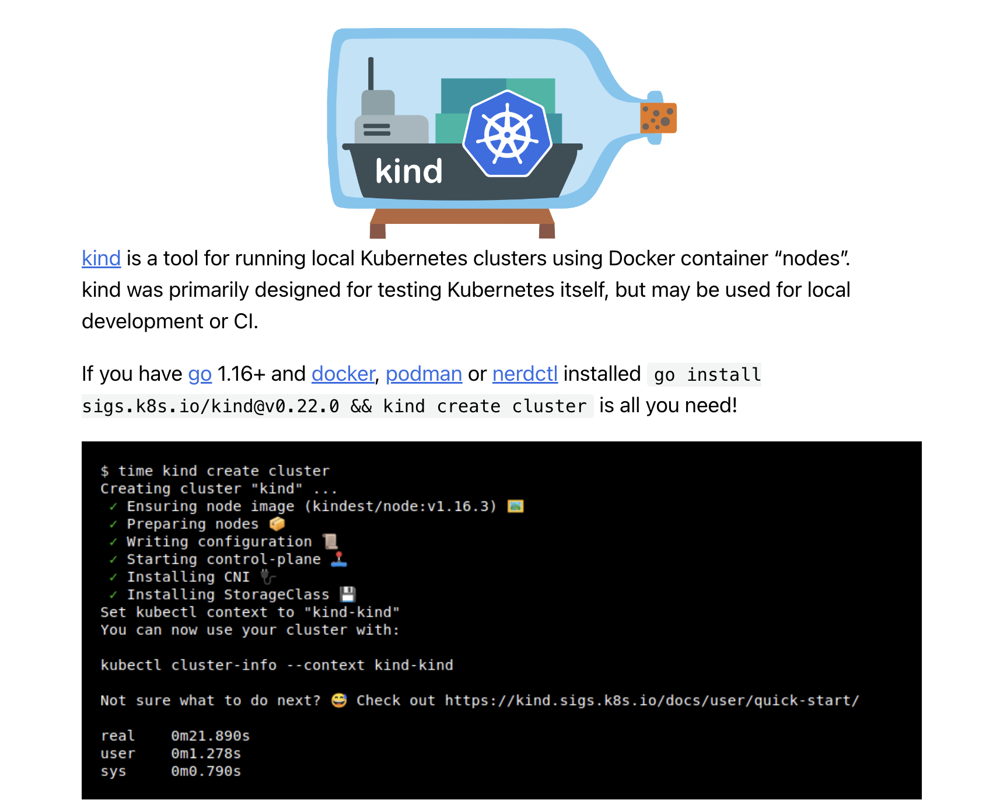
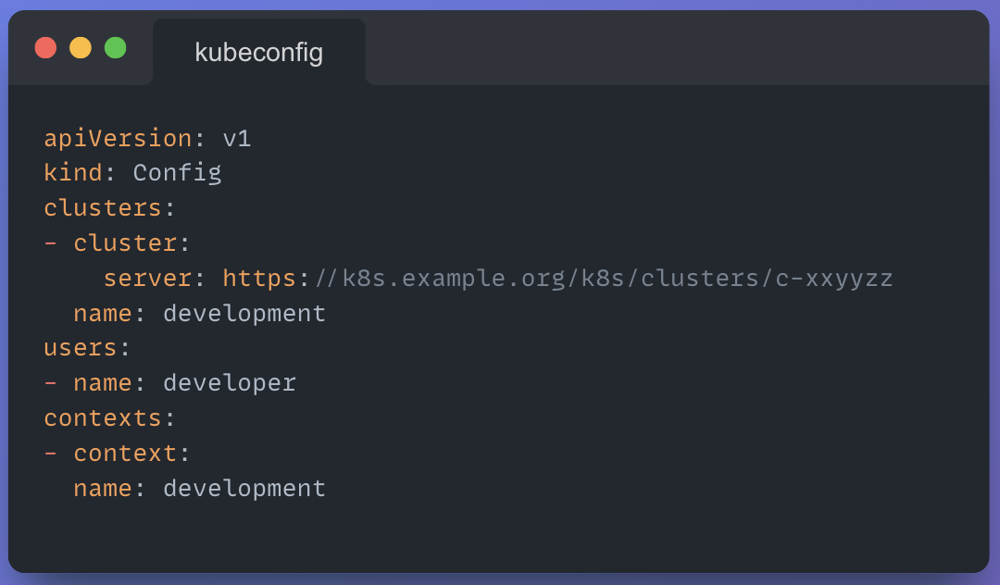
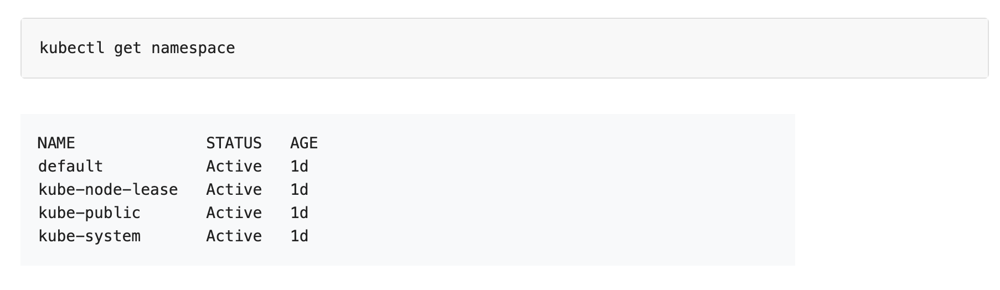
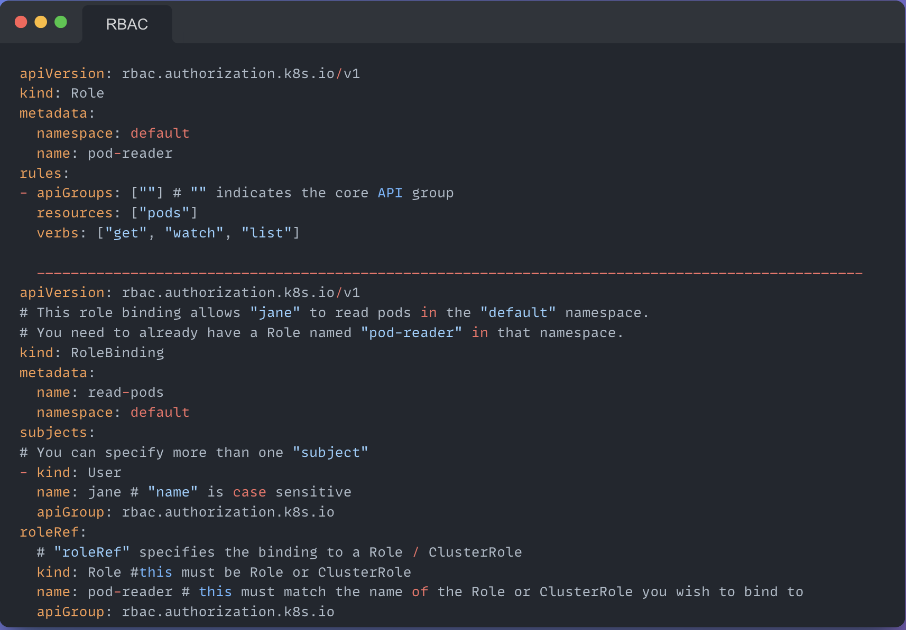
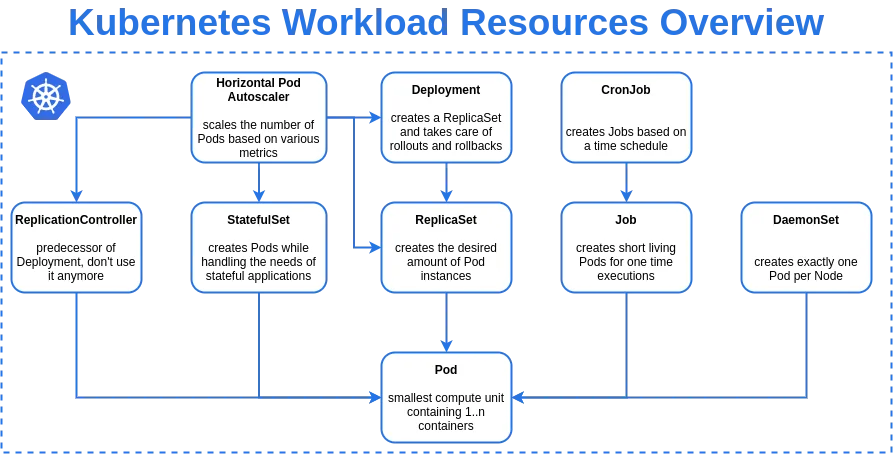
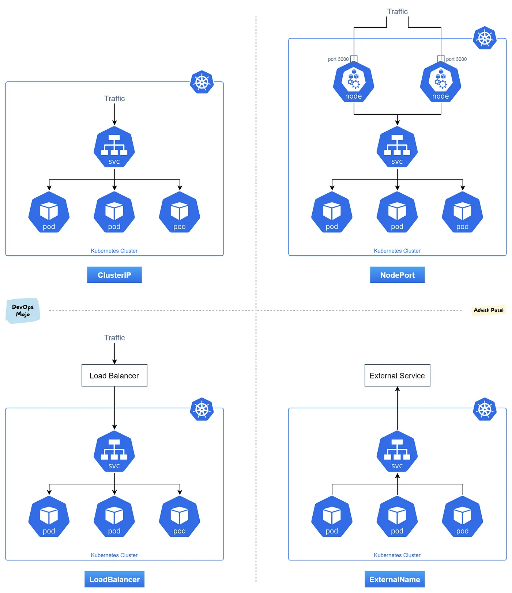
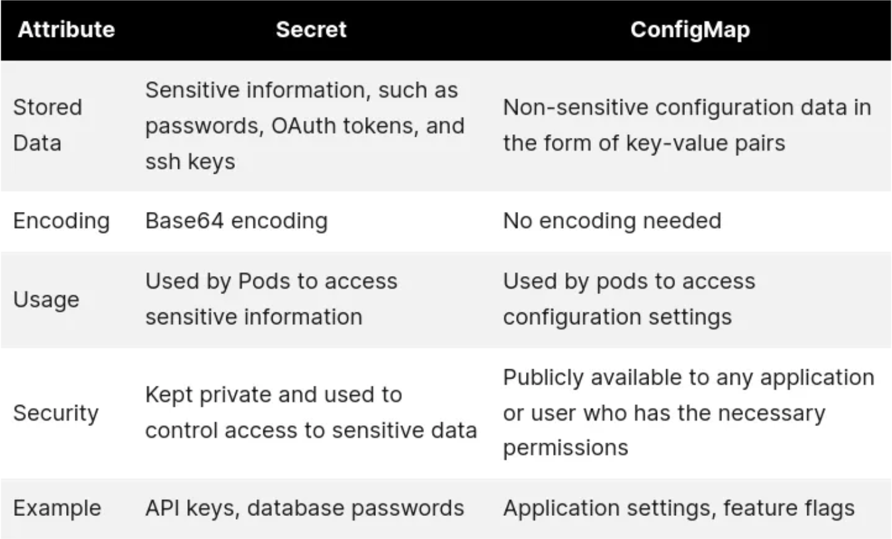
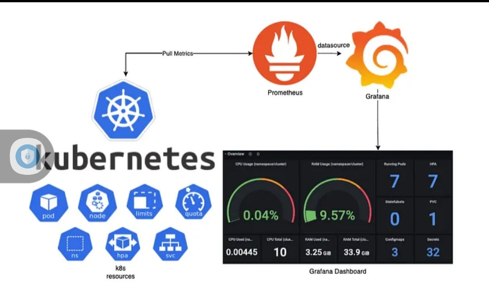
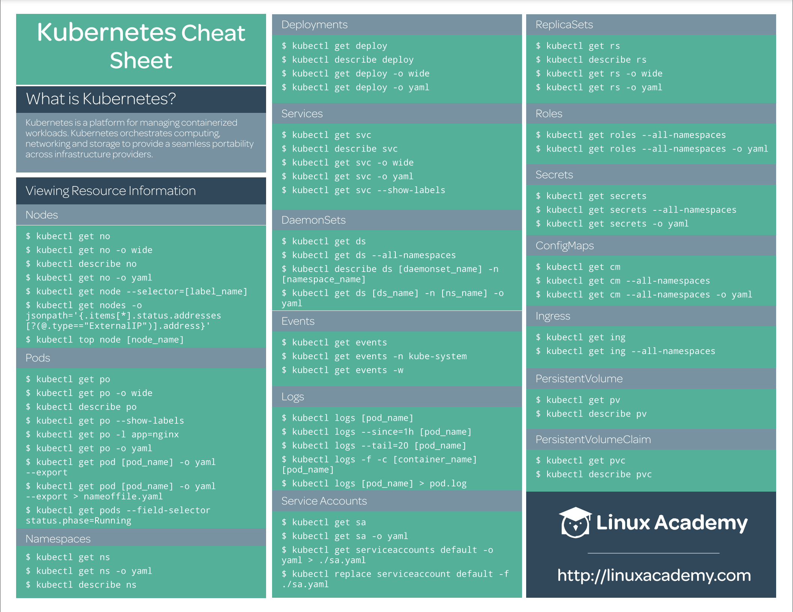
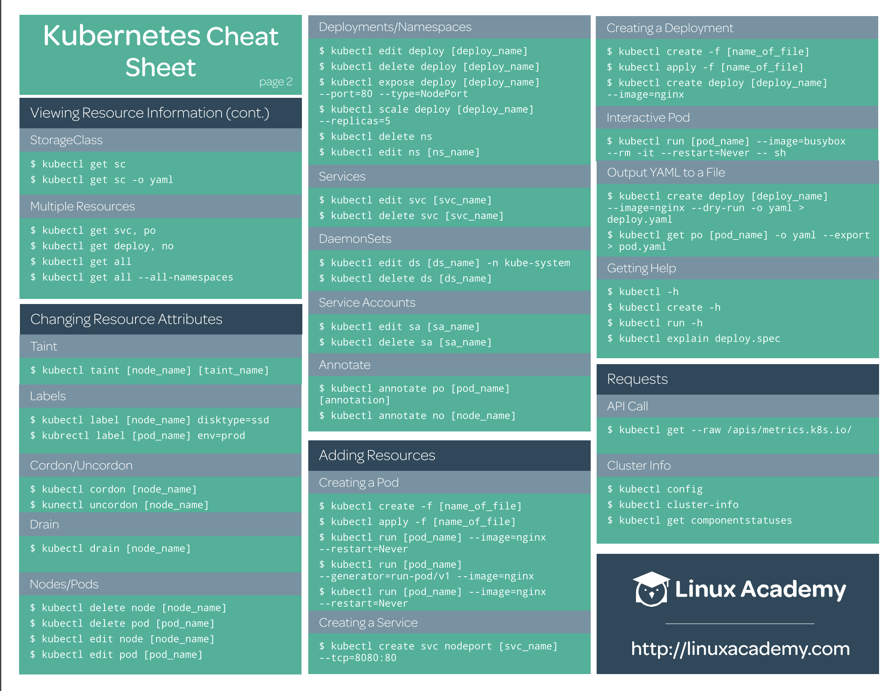

# Kubernetes - Cubernetes 

## [Roadmap](kubernetes.pdf)

## [Setup your first Kubernetes cluster with Kind](https://kind.sigs.k8s.io/docs/user/quick-start/#installation)
   ### 

## [Architecture](https://kubernetes.io/docs/concepts/architecture/)
   ### 

   

## [Organizing Cluster Access Using kubeconfig Files](https://kubernetes.io/docs/concepts/configuration/organize-cluster-access-kubeconfig/)
   ### 

## [Namespaces](https://kubernetes.io/docs/concepts/overview/working-with-objects/namespaces/)
   ### 

## [RBAC]()
   ### 

## Workload objects
   ### 
   ### Pods
   ### Replicaset
   ### Deployments
   ### Daemonsets

## Service & load balancing
   ### 

   
## Configmap & secrets
   ### 

## Volumes
   ### 

   
## Scaling your app

## Updating K8S application

## Debugging application

## Monitoring & Logging
   ### 

## Kubernetes cheatsheet
   ### 
   ### 
   
